# 强棒天使项目简介
## 一、 项目起源
棒球是世界最受欢迎的体育运动之一，棒球运动强身益智、崇尚礼仪，是家庭化、团队化的体育项目。每年全球有超过 20 亿的观众观看棒球赛事。棒球世界排名前四的是日本，美国，韩国，中国台湾，所以棒球也是最适合亚洲人的体育运动。目前，中国棒球在世界排名约 20 左右，仍处于起步阶段，具有很大的上升空间，并且在一二线城市已经逐渐被大家所认可。随着棒球产业的不断发展，棒球人才的需求量将越来越大，棒球人才的未来机遇也将前所未有。     

**项目主要发起人孙岭峰**：从 7 岁跟随“国宝级”教练张锦新学习棒球，与棒球相伴 30 余载。曾任国家棒球队队长 15 年，连续三届亚洲盗垒王，国家队第一棒、当家中外野手。棒球是他的生命。他的成长经历证明了棒球可以改变人生。中国队长的梦想，用棒球给困境中的孩子一个重新选择未来的机会。有一天，他将带着这些孩子一起，让中国棒球得到世界的尊重。

## 二、项目概述及意义

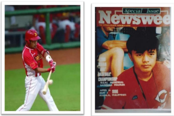  

**“强棒天使项目”紧跟国家“精准扶贫”的公益战略方针**      
针对 7-9 岁贫困儿童进行全面帮扶。经过多年的专业和系统的棒球训练，完成对孩子未来的职业规划，一方面消除了社会的安全隐患，让这些儿童能够有一技之长，得到全面的素质培养，另一方面为中国棒球产业的发展储备并输送大量的人才。习近平主席曾经说过：抓好教育是扶贫开发的根本大计，要让贫困家庭的孩子都能接受公平的、有质量的教育，起码学会一项有用的技能，不要让孩子输在起跑线上，尽力阻断贫困代际传递。把贫困地区孩子培养出来，这才是根本的扶贫之策。**“授人以鱼不如授人以渔”**，强棒天使项目通过长期投入的方式，培养孩子棒球职业能力，在解决基本生活的同时，塑造他们健全、独立的品格，帮助他们实现更高层次的人生目标。 

## 三、项目概况及发展历程
+ **5 年里的 4 个家**     
2015 年 12 月孙岭峰与前中国棒球协会常务副主席李高潮、前中国棒球协会青少年委员会主任张锦新等爱心人士联合发起成立“强棒天使项目”，并在昌平区小汤山建设了“强棒天使爱心棒球基地”，开始创建第一支中国公益棒球队“强棒天使队”。由于拆迁等原因，基地 5 年搬了 4 次家，最终在北京市通州区漷县镇落脚。       
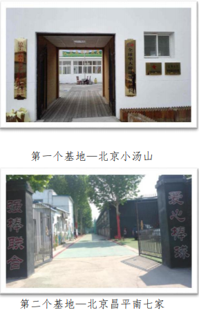  
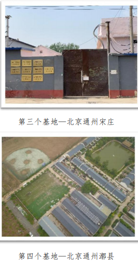      
+ **走访筛选资助对象**      
“强棒天使项目”主要资助对象为全国范围内 7-9 岁的困境儿童，以集中培训的形式，使被资助者以专业的棒球技能获得职业发展方向和未来的就业机会。5 年来，项目通过与各地政府机构、基层组织、民间团体的合作，走访了全国 300 个家庭，筛选出 80 余名困境儿童进行资助培训。目前有 68 名困境儿童在北京通州区漷县镇的“强棒天使棒球基地”参加集中培训。他们分别来自全国 9 个地区，包括彝族等 6 个少数民族。其中男孩 42 名，女孩 26 名。年龄最小的 7 岁，最大的 14 岁，少数民族占 75%。“强棒天使队”是一支名副其实的由困境儿童组成的多民族公益棒球队。    
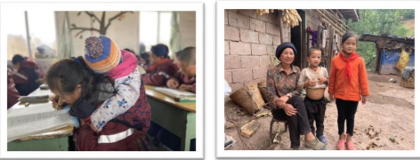  
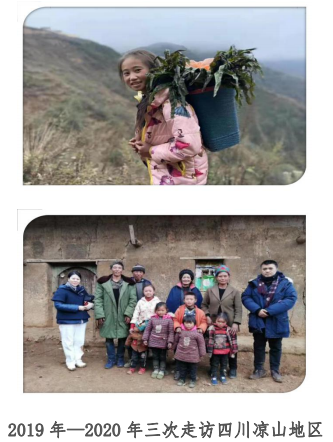      

+ **专业的棒球训练**       
“爱心棒球基地”实行全封闭管理的模式。目前以 4 个年龄段组为主，分别是男队 U8、U10、U12、U15 和女队 U10、U12。孩子们到达基地后，将根据年龄分配到不同组队。孩子们会在基地接受专业的棒球职业训练。中国棒球“国宝级”老教练张锦新担任训练总顾问，老人作为志愿者，长期驻扎在基地，与孩子们同吃同睡同训练，孩子们都亲切的叫他“师爷爷”。主教练孙岭峰针对孩子的年龄段及其特征制定训练方案，并带领 4 个分组教
练完成每日训练任务。日常训练的内容以基础力量、专项技能、战术配合训练为主，同时教练员也负责队员的日常行为准则、思想动态、心理疏导等任务。       
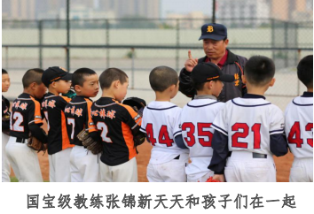  
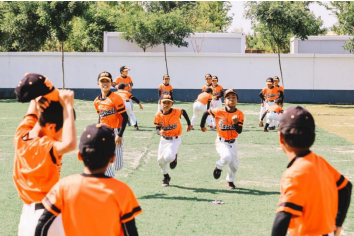 

+ **基地是孩子们的家**         
基地除配有室外标准训练场及比赛场外，还配有厨房、餐厅、宿舍、浴室、学习室、图书室、活动室等多种功能设施。除保障正常的文化学习、训练及营养外，还有专人负责运动康复及日常医疗保障。         
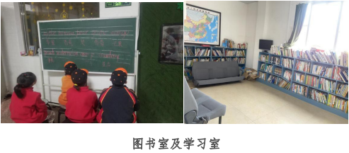  
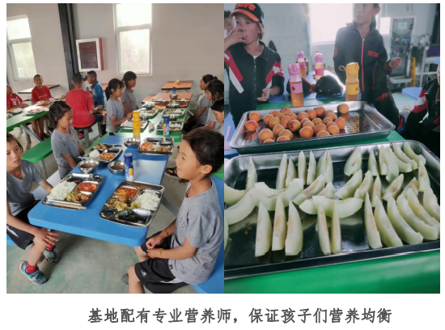  
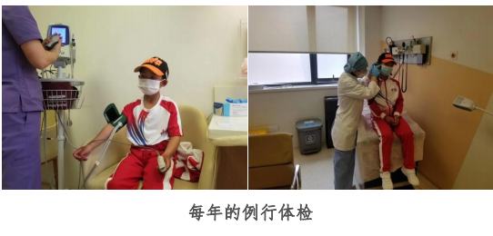 
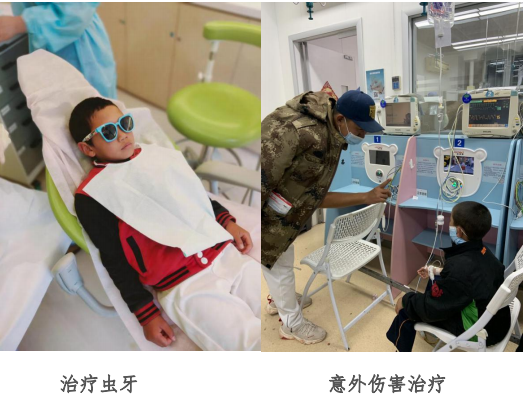 

+ **丰富多彩的课外活动**     
基地会定期组织各项主题活动，如春天去北京动物园春游、夏天去颐和园划船、秋天去天安门广场看升旗、冬天去庙会、去山区种树、参观博物馆、圣诞 party、集体观看各种演出，每月生日会、端午节包粽子等等，让孩子们在各种活动中增长见识，学习传统文化知识，获得更多认识世界的机会。               
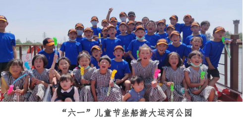  
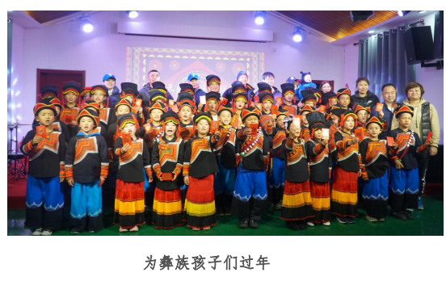  

## 四、成材计划     
“强棒天使棒球队”将参加各种国内外知名赛事，随着年龄的增长并根据自身发展特点、参与比赛名次及文化学习成绩，队员会进入北京棒球传统校或职业高中进行学习，成绩优秀者还可进入知名大学继续深造。队员成年后，将会利用所学完成职业规划。
+ 通过选拔输送到美国 MLB、韩国 KBO、日本 NPB 以及台湾CPBL 等世界顶级职业联盟打球，成为世界级棒球明星。     
+ 进入中国国家棒球队及各省市专业队参加职业联赛。      
+ 进入棒球培训体系成为一名棒球培训师，完成职业规划。        

## 五、赛事成绩及荣誉     
“强棒天使队”，是中国第一支由困境儿童组成的公益棒球队，中国第一支由多民族儿童组成的棒球队，中国第一支代表亚太地区征战世界的少年棒球队。在国内外多项棒球赛事中披金斩银，成为了国内球队同年龄段当仁不让的第一，形成了难以置信的影响力。不仅中国的球队以能跟天使队打场比赛为荣，韩国、日本、美国的一些世界级的联赛争相邀请强棒天使队，作为中国最高水平的队伍参赛。“强棒天使队”经常被邀请参加国内省市间的友谊邀请赛，同时作为北京唯一一支职业棒球队—北京猛虎队的后备力量培养。          
2017 年 7 月“强棒天使队”有 4 名孩子入选国家少年棒球队，奔赴日本代表中国参加著名国际青少年棒球赛事 PONY 杯，并荣获成长组冠军。          
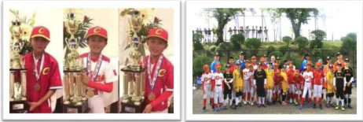      
2018 年 8 月，“强棒天使队”受到了来自 PONY 少棒联盟美国组委会的官方关注，作为亚太区的唯一一支代表队，球队受邀参加 2018 年 PONY 世界大赛 U11 Bronco 组决赛阶段的角逐，这是中国棒球历史上首次直接获邀代表亚太区参加国际青少年棒球赛事，刷新了中国体育的历史。赛事期间，球队在当地形成轰动性的影响，孩子们健康、阳光、坚强的动人事迹登上著名报纸《波士顿环球报》、《世界日报》、《侨报》等美国媒体。        
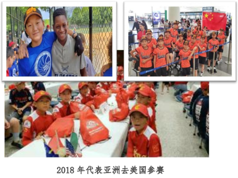       
2019 年 12 月“强棒天使队”作为除了主办地深圳外的唯一一支球队，受邀参加了在深圳举行的“第三届海峡两岸学生棒球联赛”U10 组别的比赛，并获得该组别所有的个人单项奖。           
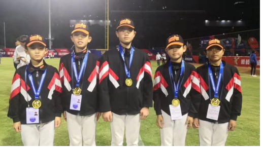   
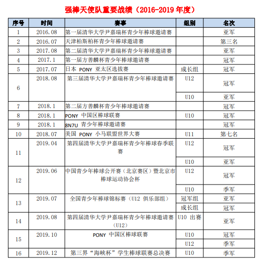   

**我们期望“强棒天使”可以让更多的困境儿童获得改变一生的机会，通过棒球这项体育运动成为国家的有用之材，为自己，为家乡，为社会，为国家做出应有的贡献，并赢得荣誉及尊重！**   
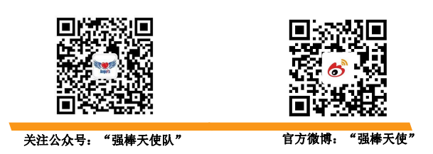  
